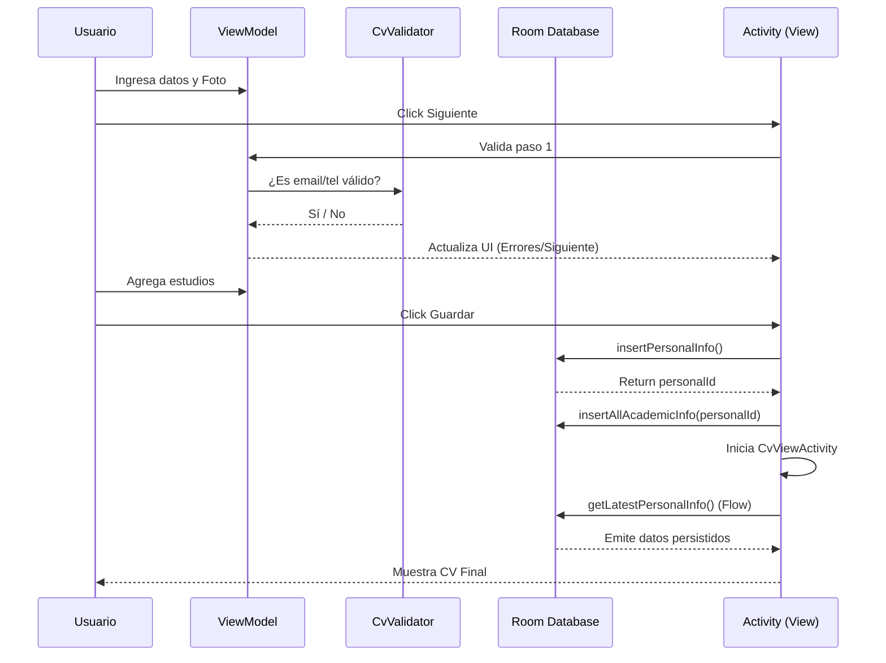

# Flujo de Ejecución Detallado - App CV

Este documento describe con precisión cómo fluyen los datos en la aplicación, desde la interacción inicial del usuario hasta la persistencia final en SQLite.

---

## 1. Fase de Inicialización (Dagger Hilt)
Al abrir la aplicación, el sistema instancia la clase `CvApplication`. 
- **Acción**: Hilt genera el árbol de dependencias.
- **Resultado**: El `CvValidator` se crea como un `@Singleton`, listo para ser inyectado donde se necesite.

---

## 2. Fase de Interacción: Paso 1 (Datos Personales)
El usuario interactúa con la `MainActivity`, la cual delega la interfaz a `CvFormScreen`.
- **Captura de Foto**:
    - Si se elige **Galería**, se obtiene un `Uri`.
    - Si se elige **Cámara**, la app crea un archivo temporal en `getExternalFilesDir` y lo pasa a la cámara.
    - **Conversión**: El `InputStream` del `Uri` se lee y se convierte en un `ByteArray` dentro del `CvFormViewModel`.
- **Validación**: Al pulsar "Siguiente", el `ViewModel` llama al `CvValidator`. Si falla (ej: email mal escrito), el `StateFlow` se actualiza con un mensaje de error que se muestra inmediatamente en los campos de texto de Compose.

---

## 3. Fase de Interacción: Paso 2 (Información Académica)
Una vez superado el Paso 1, el estado `currentStep` cambia a 2.
- **Gestión de Lista**: Los registros académicos (Universidad, Carrera, Año) no se guardan individualmente en la BD aún. Se mantienen en una `mutableStateListOf` dentro del `ViewModel`. 
- **Relación N:1**: En esta etapa, el `personalInfoId` de cada registro es `0` de forma temporal.

---

## 4. Fase de Persistencia (Room Manual)
Cuando el usuario pulsa **"Guardar CV"** en la `MainActivity`:
1.  **Instancia de BD**: Se llama a `AppDatabase.getDatabase(context)`. Al ser un objeto `object` (Singleton), garantiza que solo exista una conexión abierta a SQLite.
2.  **Transacción de Datos**:
    - **Paso A**: Se inserta el objeto `PersonalInfoEntity`. Room, mediante el DAO, ejecuta un `INSERT` y devuelve el `rowId` (el ID autogenerado por SQLite).
    - **Paso B**: Se crea una nueva lista de `AcademicInfoEntity` mapeando la lista temporal del ViewModel y asignándoles el `personalId` obtenido en el Paso A.
    - **Paso C**: Se inserta toda la lista académica mediante `insertAllAcademicInfo`.
3.  **Migración**: Si la versión de la BD subiera a 2, el bloque `addMigrations` en `AppDatabase` se encargaría de ejecutar los SQL necesarios para no perder datos.

---

## 5. Fase de Visualización (Reactividad)
Se inicia `CvViewActivity`.
- **Observación**: Esta actividad no hace una consulta única ("One-shot"). Usa `Flow<PersonalInfoEntity?>`.
- **Flujo**: 
    - `db.personalInfoDao().getLatestPersonalInfo()` abre un canal de datos.
    - Tan pronto como hay un cambio en la tabla, la UI de Compose se recompone automáticamente.
- **Decodificación**: El `ByteArray` de la foto se convierte de nuevo a `Bitmap` usando `BitmapFactory.decodeByteArray` para ser renderizado en el componente `Image`.

---

## Diagrama de Secuencia

